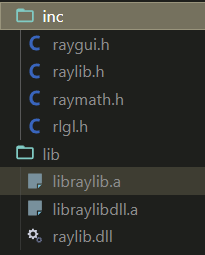
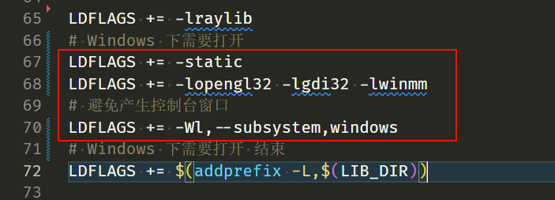

# 学习与编译过程

## 功能

-   只需点点按钮即可完成编译、运行、调试，基于`raylib`等库的可执行程序
-   适用于学习某个库的不同模块和各种示例
-   多个可执行程序共用一个缓存目录


## 目录介绍

`.vscode` - 插件配置 和 调试配置
`build` - 编译产物目录
`lib` - 库文件目录
`inc` - 头文件目录
`sources` - 编译套件、库的源代码
`base.mk, Makefile` - 编译运行的项目配置文件
`mod.mk` - 处理模块间源代码依赖
其他目录 - 模块目录


## 使用

参看Makefile中的用法


## 环境准备

-   编辑器： [`VSCode`](https://code.visualstudio.com/)

-   Windows下，下载安装编译套件： [`w64devkit`](https://github.com/skeeto/w64devkit)

-   构建工具：`.vscode` + `make`
    -   `.vscode`是目录名，包含项目级别的VSCode的配置，有调试用的配置
    -    Windows下，`make`在`w64devkit`套件中，无需额外安装。Ubuntu下 ，执行`sudo apt install make`安装
    
-   根据系统，下载[raylib库和头文件](https://github.com/raysan5/raylib/releases)（看下面版本说明），解压其中库文件和头文件到lib和inc目录
    -   版本说明：更新较快，接口可能有变动，最好使用以下版本
    -   当前使用版本： [raylib v5.5](https://github.com/raysan5/raylib/releases/tag/5.5) - [raylib-5.5_win64_mingw-w64.zip](https://github.com/raysan5/raylib/releases/download/5.5/raylib-5.5_win64_mingw-w64.zip)和[raylib-5.5_linux_amd64.tar.gz](https://github.com/raysan5/raylib/releases/download/5.5/raylib-5.5_linux_amd64.tar.gz)
    
-   下载[raygui头文件](https://github.com/raysan5/raygui/releases)，解压到inc目录
    -   当前使用版本[raygui v4.0](https://github.com/raysan5/raygui/releases/tag/4.0)
    
        
    
-   Ubuntu系统

    1.   需要注释或删除Makefile中的这部分，红框部分

         

         

    2.   根据[文档指导](https://github.com/raysan5/raylib/wiki/Working-on-GNU-Linux)，安装以下内容

         ```shell
         sudo apt install libasound2-dev libx11-dev libxrandr-dev libxi-dev libgl1-mesa-dev libglu1-mesa-dev libxcursor-dev libxinerama-dev libwayland-dev libxkbcommon-dev
         ```

-   Windows远程连接Ubuntu

    1.   VSCode需要端口映射。执行`export DISPLAY=:10.0`。最好还是本地环境执行


## 按钮化

不想输入子模块路径？
安装`vscode`插件：`seunlanlege.action-buttons`
配置见`.vscode/settings.json`文件
重启`VSCode`后，左下角状态栏会多出有5个按钮
先打开要编译的包含main函数文件（该目录下任何文件都行），再点击按钮


## 问题与解答

1. 有重复的代码想要独立出来，作为公共的，其他模块的依赖？
    答：参看`mod.mk`

2. 编译过程？
    答：将当前打开文件目录（`fileDirname`）的所有`.c`源文件，以及`mod.mk`中指定`.c`源文件，都编译链接。
   过程文件和可执行文件存放在build目录。

3. 运行过程？
    答：静态链接，直接运行

4. 找不到编译工具？

  答：最简单的方法，下载`w64devkit`，安装或解压到sources目录

  所有有关的配置，就像下面这样

  ```shell
  # .vscode/launch.json
              "miDebuggerPath": "${workspaceFolder}/sources/w64devkit/bin/gdb.exe",
  
  # .vscode/settings.json
                  "command": "${workspaceFolder}/sources/w64devkit/bin/make.exe MOD_ABS_PATH=${fileDirname} run",
  
  # Makefile
  CROSS_COMPILE := sources/w64devkit/bin
  ```

  如果希望安装在别处，那，

  1.   要么设置环境变量，可以直接在终端执行相应程序。这样的话，所有有关的配置，就像下面这样

       ```shell
       # .vscode/launch.json
                   "miDebuggerPath": "gdb.exe",
       
       # .vscode/settings.json
                       "command": "make.exe MOD_ABS_PATH=${fileDirname} run",
       
       # Makefile
       CROSS_COMPILE :=
       ```

  2.   要么直接给出绝对路径。所有有关的配置，就像下面这样

       ```shell
       # .vscode/launch.json
                   "miDebuggerPath": "G:/w64devkit/bin/gdb.exe",
       
       # .vscode/settings.json
                       "command": "G:/w64devkit/bin/make.exe MOD_ABS_PATH=${fileDirname} run",
       
       # Makefile
       CROSS_COMPILE := G:/w64devkit/bin
       ```

       
